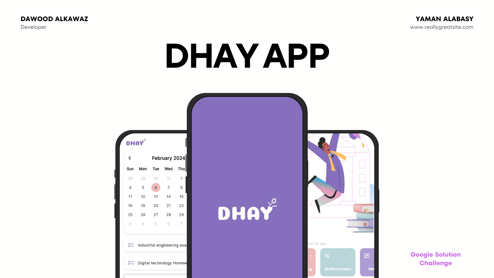
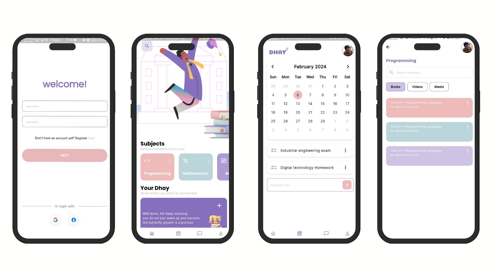
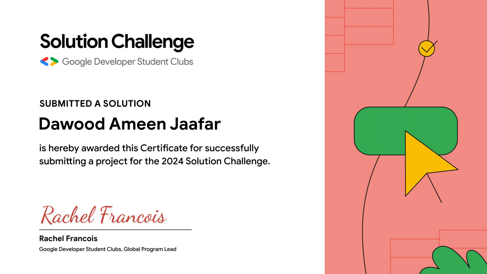

# Dhay_App

## Table of content

- [Overview](#overview)
- [Screenshots](#screenshots)
- [Team](#team)
- [Certificate](#certificate)

## Overview

**Dhay** app is a mobile app developed to provide students with multiple resources tailored toward there academic fields.
This **front-end** project is part of [**Google Solution Challenge**](https://developers.google.com/community/gdsc-solution-challenge)

## Screenshots

## Team

This project is a participation with [**GDC-University of Technology of Baghdad**](https://gdsc.community.dev/university-of-technology-baghdad-iraq/)

- Sketch: [**Ali Ameer**](https://www.instagram.com/_jhi.1)
- User Interface: [**Yaman Alabasy**](https://www.instagram.com/yaman_abasy)
- Front-end Developer: [**Dawood Alkawaz**](https://github.com/xdv99)

## Certificate

